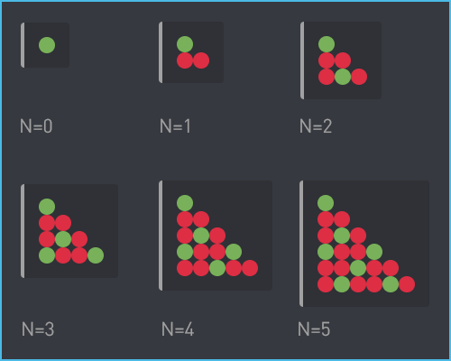
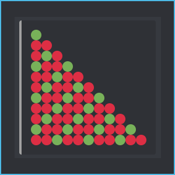

# Writing a Pattern Algorithm

Let's think about an algorithm from pattern of symbols drawn to xy-coordinate grid. In Discord's context, an embed having emojis would be one way of doing this. 



There are many correct solutions for this problem. You should think of this as top-down xy-coordinate grid \(The coordinate system for pixels in a computer is reversed along the y-axis and not like Cartesian system teached in schools\) and just draw the red/green symbols on a piece of paper and find the patterns for each step of N. Find repetition and counting behaviour.

```text
generalizing steps having N=3
    green emoji at (0,0)
    red emoji at (0,1)
    red emoji at (0,2)
    green emoji at (0,3)
    
    red emoji at (1,1)
    green emoji at (1,2)
    red emoji at (1,3)
    
    red emoji at (2,2)
    red emoji at (2,3)
    
    green emoji at (3,3)
```

In code-block above there's repetition and counting. You see x-coordinate increase by each step and these  are grouped in separate paragraphs. So we are counting x and repeating somewhat similar colour and y- coordinate changes.

Looking at y-coordinates first. If we look at this first group of steps, we see that the y-coordinates go from zero to three, then from one to three and then from two to three. In general for N=3 we are counting from x to 3 for y.

Now we have to look at the repeating patterns for colours. When is the emoji green, when is it red. The coordinates decide that. To understand it better, let's increase the N steps count to 5.

```text
generalizing green emoji having N=5 steps
    green at (0,0)
    green at (0,3)
    green at (1,2)
    green at (1,5)
    green at (2,4)
    green at (3,3)
    green at (4,5)
```

We can see that the repeating pattern for green here is x+y being multiple  of 3. 

So we can generalize it to an algorithm: _Counting from 0 to `N` \(both inclusive\), call each number `x` and from 0 to `x` \(both inclusive\), call each number `y`. If x+y is multiple of three, place green emoji, otherwise place red emoji._

Write a CC which makes an embed with that emoji pattern in `cembed` `"description"` field and can take only an _int_ from 0 to 15 as `N`, use `carg` as limiter. Also try to use emojis \(:circle\_red: and :circle\_green:\) as codepoints with `printf` not copy/paste them directly as Unicode.



[Example solution](https://pastebin.com/0VDf2uhT).

