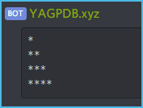

# Generalizing Repetitions - Stars

important part of generalizing an algorithm is to look for repetitions of the same \(or similar\) steps. When similar steps repeat, you will want to generalize your algorithm in terms of how many times the steps repeat \(or until what condition is met\).  
  
Let's look at this problem:    
**Given an integer N \(&gt;0\), print a right triangle of \*s, with height N and base N.**

Looking at the printout above \(you should draw these out by hand\), try to recognize the patterns.  
`Print 1 star  
Print a newline  
Print 2 stars  
Print a newline  
Print 3 stars  
Print a newline  
Print 4 stars  
Print a newline`

To further generalize this repetition we can now form an algorithm:  
`count (let's call it i) from 1-star to N (inclusive)  
print i stars  
print newline`  
  
So try to write down  this algorithm of our stated problem as CC-code in YAGPDB. This exercise needs `range` function for counting the steps.  Also remember the limitations of Discord - 2 000 characters. Why is that and how to prevent it from happening? Why can the max N be 61? Also due to problem statement we have to use a star/asterisk symbol \*. Discord formats it as italics or bold text so we need to use a code-block to get raw output.

Example solution.

